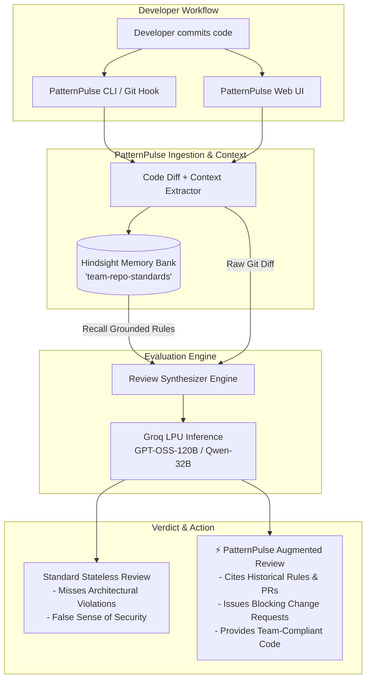

# ⚡ PatternPulse

> **The Persistent Memory-Augmented Architectural Code Review Engine**  
> *Transforming code reviews from stateless syntax linting into grounded, organization-aware architectural enforcement.*

[](https://fastapi.tiangolo.com)
[](https://react.dev)
[](https://hindsight.vectorize.io)
[](https://groq.com)
[](LICENSE)

---

## 📌 Executive Summary & The Problem

Modern AI code reviewers (such as generic LLMs, copilot agents, and traditional linters) operate under **Stateless Amnesia**:
- They review every Pull Request in total isolation.
- They check syntax, typing, and standard language idioms, but they have **zero memory** of your organization's past PR debates, architectural decisions (ADRs), post-mortems, security mandates, or multi-tenancy requirements.
- **The Result**: A developer submits code with direct database queries in a Next.js server action or stores sensitive JWTs in `localStorage`. A standard AI reviewer happily approves: *"Looks clean, strong typing, well-structured!"* Meanwhile, hard-earned team conventions established months ago are silently broken.

### 💡 The Solution: PatternPulse
**PatternPulse** bridges the gap between organizational history and automated code review. Powered by **Hindsight persistent vector memory** and **Groq high-speed LLM inference**, PatternPulse:
1. **Recalls** pertinent architectural rules, RFCs, and post-mortems grounded in the code context of the PR.
2. **Evaluates** code diffs against historical team memory.
3. **Blocks** non-compliant PRs with exact citations (author, original PR, rationale) and supplies production-ready compliant code replacements.
4. **Learns** new architectural conventions dynamically in real-time from the CLI or web dashboard.

---

## 🌟 Key Features

- **Side-by-Side Cognitive Comparison**: Simultaneously inspect how a **Stateless Baseline LLM** evaluates a PR versus how **PatternPulse Memory Engine** catches deep architectural violations.
- **Instant Vector Memory Recall**: Surfaces relevant historical policies and conventions within milliseconds before synthesizing the review.
- **Real-Time Knowledge Ingestion ("Teach PatternPulse")**: Add new architectural decisions, security requirements, or post-mortem learnings on the fly via the Web UI or CLI.
- **Interactive Cyberpunk Dashboard**: Built with React 19, Tailwind CSS, Lucide icons, and FastAPI for real-time diff inspections, memory bank diagnostics, and interactive review runs.
- **Developer CLI & Pre-Push Hook**: Run reviews directly from the terminal or block architectural violations automatically before `git push`.
- **Pre-Configured Scenarios**: Comes out-of-the-box with battle-tested architectural scenarios (Direct Prisma queries vs. Service Layer, Insecure JWT storage vs. HttpOnly cookies).

---

## 🏗️ Architecture & Data Flow



---

## 🔍 Side-by-Side Review Benchmark

| Aspect | Standard Stateless AI Linter | ⚡ PatternPulse Memory Reviewer |
| :--- | :--- | :--- |
| **Awareness** | Pure syntax, typing, and standard library conventions | Team RFCs, past PR reviews, post-mortems, security policies |
| **Scenario 1: Direct DB Query in Server Action** | **APPROVED**: *"Code is clean, TypeScript types look solid, error handling is present."* | **BLOCKED (PR #42 by Alex)**: *"Direct Prisma queries in Server Actions are forbidden. Route through `lib/services/*` to enforce multi-tenant isolation."* |
| **Scenario 2: JWT in `localStorage`** | **APPROVED**: *"Standard client-side storage pattern."* | **BLOCKED (PR #19 by Sarah)**: *"Storing JWTs in localStorage violates team security policy due to XSS vulnerability. Use HttpOnly cookies."* |
| **Remediation** | Generic suggestions | Exact drop-in replacement code conforming to repository patterns |

---

## 🚀 Quick Start Guide

### 1. Prerequisites
- **Python**: 3.10 or higher
- **Node.js**: 18.0 or higher
- **Groq API Key**: [Console Groq](https://console.groq.com)
- **Hindsight API Key**: [Hindsight / Vectorize](https://hindsight.vectorize.io)

### 2. Clone the Repository
```bash
git clone https://github.com/ChallaSravanReddy/Pattern_pulse.git
cd Pattern_pulse
```

### 3. Set Up Python Environment
```bash
# Create virtual environment
python -m venv venv

# Activate virtual environment
# Windows (PowerShell):
.\venv\Scripts\Activate.ps1
# macOS / Linux:
source venv/bin/activate

# Install dependencies
pip install -r requirements.txt
```

### 4. Configure Environment Variables
Copy the example environment file and insert your API keys:
```bash
cp .env.example .env
```
Edit `.env`:
```env
HINDSIGHT_API_KEY="your_hindsight_api_key"
HINDSIGHT_BANK_ID="team-repo-standards"
HINDSIGHT_BASE_URL="https://api.hindsight.vectorize.io"

GROQ_API_KEY="your_groq_api_key"
GROQ_MODEL="openai/gpt-oss-120b"
```

### 5. Seed Initial Team Architectural Memory
Populate the Hindsight persistent memory bank with standard architectural conventions:
```bash
python seed_memory.py
```

### 6. Build the Frontend Assets
```bash
npm install
npm run build
```

### 7. Run the Web Dashboard
```bash
python server.py
```
Open your browser and navigate to: **`http://localhost:8000`**

---

## 💻 CLI Usage & Git Integration

PatternPulse provides a high-performance CLI with rich terminal formatting.

### Commands

#### 1. Review Code Diffs
```bash
# Review preset Prisma database violation scenario
python cli.py review --scenario prisma

# Review preset Authentication/JWT security violation scenario
python cli.py review --scenario auth

# Review your local unstaged/staged git changes
python cli.py review --scenario git

# Review without the stateless baseline comparison
python cli.py review --scenario prisma --no-compare
```

#### 2. Teach PatternPulse a New Convention (Learn Mode)
```bash
python cli.py learn "All outbound API calls must specify a 5000ms timeout" --author "Platform Lead" --category "networking"
```

#### 3. Inspect Memory Bank Health
```bash
python cli.py status
```

### 🛡️ Install Git Pre-Push Hook
Prevent architectural violations from ever reaching the remote repository:
```bash
# Copy or create pre-push hook
# Windows / Linux / macOS
cp .git/hooks/pre-push.sample .git/hooks/pre-push
```
Add the following to `.git/hooks/pre-push`:
```bash
#!/bin/sh
echo "⚡ Running PatternPulse Architectural Review before push..."
"./venv/Scripts/python" cli.py review --scenario prisma
if [ $? -ne 0 ]; then
    echo "❌ PUSH ABORTED: Architectural violations detected in team memory."
    exit 1
fi
```
Make executable (`chmod +x .git/hooks/pre-push` on Unix).

---

## 🔌 REST API Reference

The FastAPI backend exposes endpoints for CI/CD pipelines and external integrations:

### `POST /api/review`
Run a code review against incoming git diffs.
- **Request Body**:
  ```json
  {
    "diff": "@@ -1,5 +1,10 @@ ...",
    "file_context": "Next.js server action database query",
    "mode": "both" // "stateless" | "hindsight" | "both"
  }
  ```
- **Response**:
  ```json
  {
    "stateless": "Markdown review from baseline LLM...",
    "hindsight": "Markdown review from PatternPulse...",
    "recalled_memories": [
      "- [WORLD] PR #42 Review: Direct Prisma calls inside Server Actions are prohibited..."
    ]
  }
  ```

### `POST /api/retain`
Retain and index a new architectural rule into team memory.
- **Request Body**:
  ```json
  {
    "rule": "Always wrap array operations on large datasets in useMemo",
    "context": "frontend_performance",
    "author": "Elena (Frontend Lead)"
  }
  ```

### `GET /api/presets`
Retrieve pre-configured diff scenarios for testing.

---

## 📂 Project Structure

```plaintext
Pattern_pulse/
├── agent_core.py          # Core review logic (Hindsight Recall + Groq Synthesis)
├── cli.py                 # Rich interactive CLI for developers
├── server.py              # FastAPI server serving Web Dashboard and REST API
├── seed_memory.py         # Memory bank initialization & seeding script
├── test_diffs.py          # Pre-configured test PR diffs
├── build.js               # ESBuild bundler configuration for React frontend
├── package.json           # Node.js dependencies (React 19, Lucide, Tailwind)
├── requirements.txt       # Python dependencies (FastAPI, Groq, Hindsight, Rich)
├── .env.example           # Environment variables template
├── src/
│   ├── main.jsx           # React application entry point
│   ├── App.jsx            # Main interactive dashboard UI
│   └── CliDocsModal.jsx   # Interactive CLI documentation modal
└── static/
    └── bundle.js          # Compiled client bundle
```

---

## 👥 Contributors & Hackathon Team

- **Challa Sravan Reddy** - *Architecture, Core Engineering & Implementation*
- Built with passion for the **Microsoft Hackathon**.

---

## 📄 License

This project is licensed under the **MIT License** — see the [LICENSE](LICENSE) file for details.
